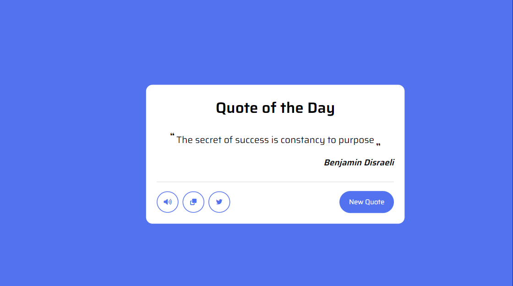
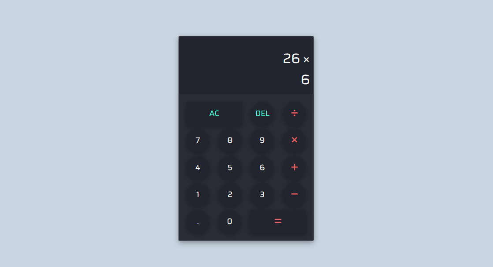
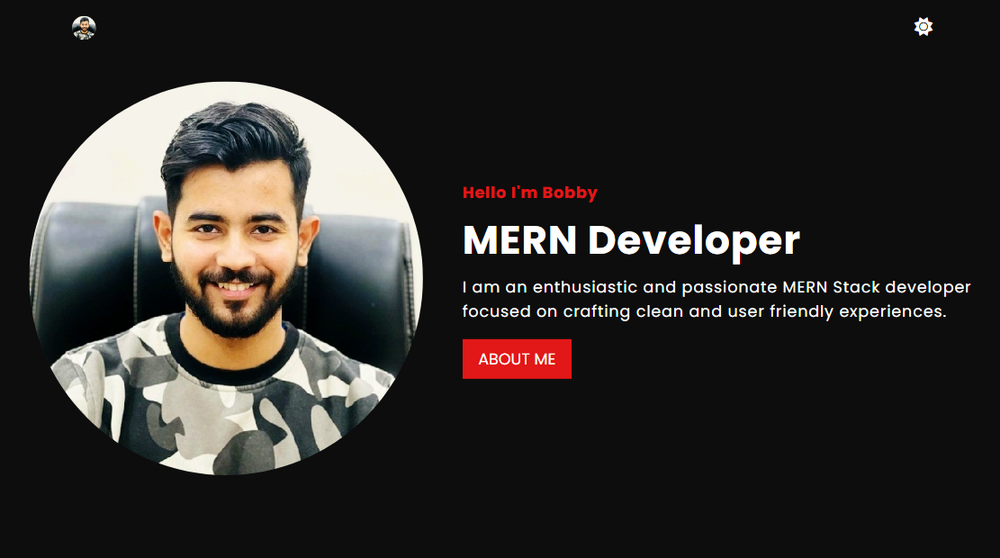
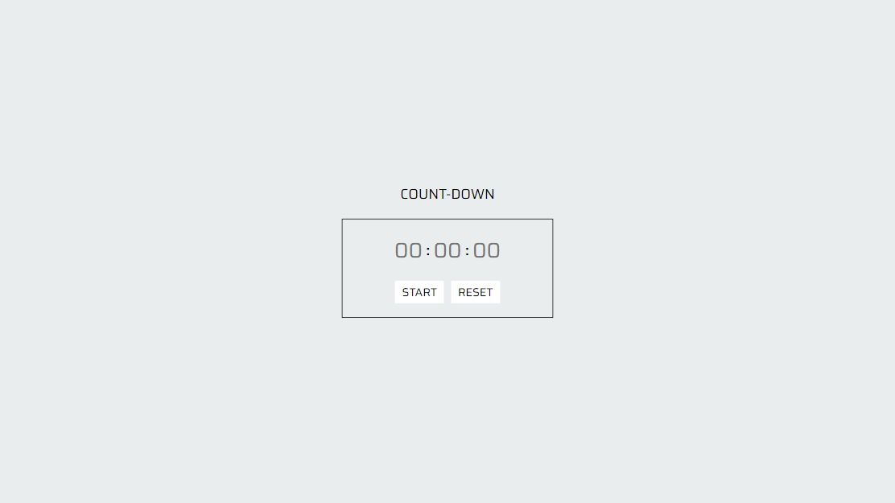
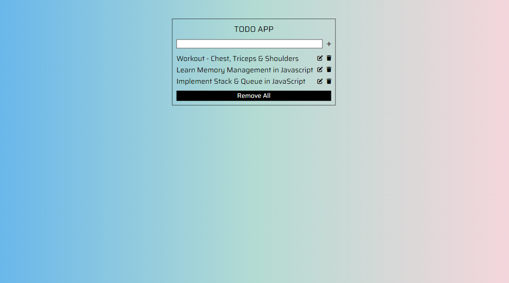
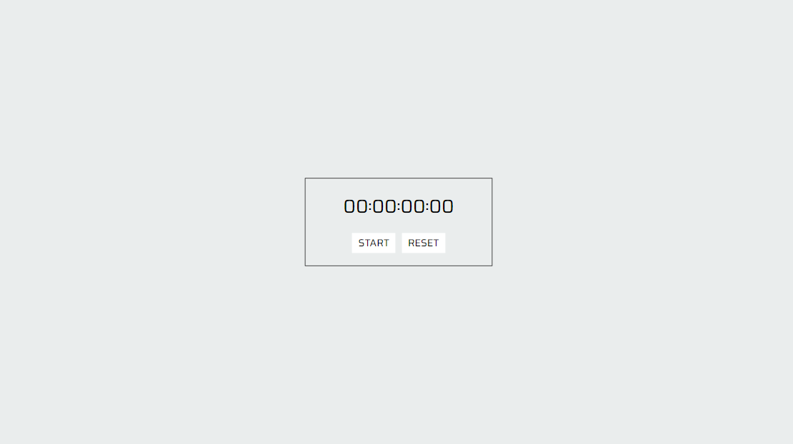
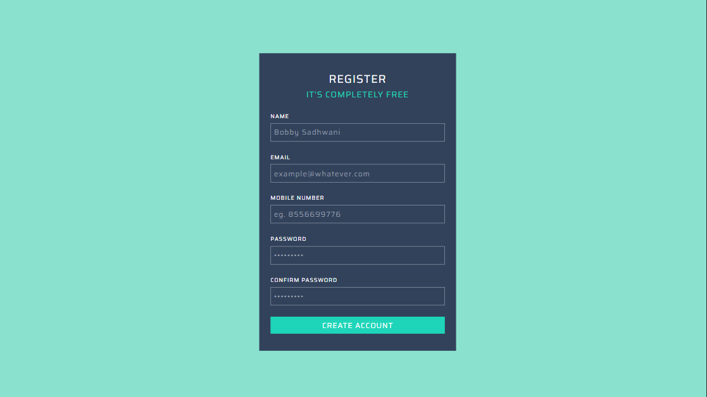

# Vanilla JavaScript Projects

## Project 1 - Random Quote Generator
[Source Code](https://github.com/Bobby-coder/Random-Quote-Generator)

## Project 2 - Calculator App
[Source Code](https://github.com/Bobby-coder/CALCULATOR-APP)

## Project 3 - Theme Switcher
[Source Code](https://github.com/Bobby-coder/Theme-Switcher-JS)

## Project 4 - Countdown App
[Source Code](https://github.com/Bobby-coder/COUNTDOWN-JS)

## Project 5 - Todo App
[Source Code](https://github.com/Bobby-coder/Todo-JS)

## Project 6 - Stopwatch App
[Source Code](https://github.com/Bobby-coder/StopWatch-JS)

## Project 7 - Registration Form
[Source Code](https://github.com/Bobby-coder/REGISTRATION-FORM)

